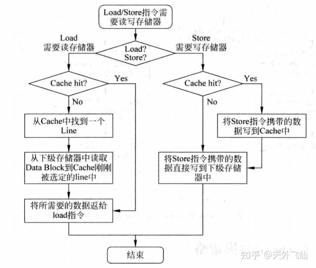
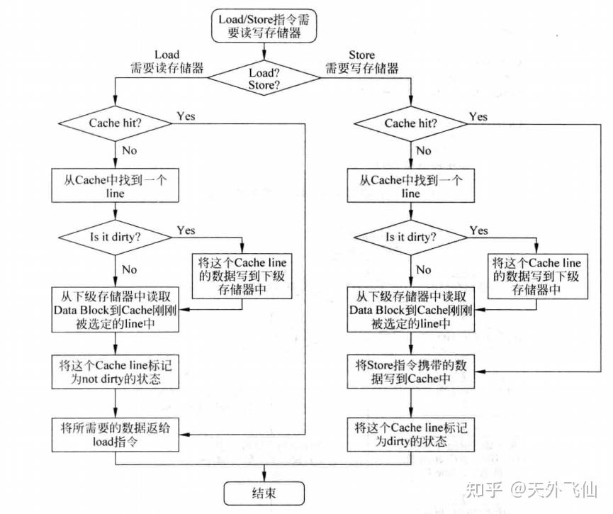

## CPU 结构

### 不同的内存层级间的特点（register，L1 cache，Memory….）

我们需要知道有那些内存层级，我们阅读了[cache高速缓存](https://zhuanlan.zhihu.com/p/482651908)，了解到了CPU的内存层级，分别是寄存器，L1 cache，L2 cache，Memory。

```plaintext
CPU寄存器--L1 cache--L2--L3--主存memory--磁盘等大容量存储器
```

计算机在运行程序时首先将程序从磁盘读取到主存，然后CPU按规则从主存中取出指令、数据并执行指令

> 计算机在运行程序时首先将程序从磁盘读取到主存，然后CPU按规则从主存中取出指令、数据并执行指令，但是直接从主存（一般用DRAM制成）中读写是很慢的，所以我们引入了cache。
> 在执行程序前，首先会试图把要用到的指令、数据从主存移到cache中，然后在执行程序时直接访问cache。如果指令、数据在cache中，那么我们能很快地读取出来，这称为“命中（hit）”；如果指令、数据不在cache中，我们仍旧要从主存中拿指令、数据，这称为“不命中（miss）”。命中率对于cache而言是很重要的。
> 现代处理器一般有三层cache，分别称为L1 cache、L2 cache、L3 cache。L1 cache离CPU核最近，存储信息的读取速度接近CPU核的工作速度，容量较小，一般分成I-cache和D-cache两块，分别存储指令和数据；L2 cache比L1更远，速度慢一些，但是容量更大，不分I-cache和D-cache；L3更慢、更大，现在流行多核处理器，L3一般由多个处理器核共享，而L1、L2是单核私有的。

- 那么我们就可以简单地描述整个CPU处理的流程和每个层级的特点
  - 寄存器：寄存器是CPU内部的高速存储单元，用于存储当前正在执行的指令和数据。寄存器的访问速度非常快，通常在一个时钟周期内完成。
  - L1 cache：L1 cache是CPU内部的一级缓存，用于存储最近使用的指令和数据。L1 cache的访问速度比寄存器慢，但是比L2 cache快。
  - L2 cache：L2 cache是CPU内部的二级缓存，用于存储最近使用的指令和数据。L2 cache的访问速度比L1 cache慢，但是比L3 cache快。
  - L3 cache：L3 cache是CPU内部的三级缓存，用于存储最近使用的指令和数据。L3 cache的访问速度比L2 cache慢，但是比主存快。
  - 主存：主存是CPU外部的大容量存储设备，用于存储所有的指令和数据。主存的访问速度比L3 cache慢，但是比磁盘快。
  - 磁盘：磁盘是CPU外部的大容量存储设备，用于存储所有的指令和数据。磁盘的访问速度比主存慢。

> 我们可以看到，不同的内存层级之间的访问速度是不同的，而访问速度越快的内存层级，成本也越高。所以我们在设计内存层级时，需要平衡访问速度和成本。

### 对于 CPU 来说计算一个 a[0:31] = b[0:31] + d[0:31] 的过程

- 首先解释一下题目： a[0:31] 是 Python 中列表/字符串/元组的语法，表示从序列 a 中取从索引 0 到索引 30 的子序列（不包括索引 31）。

- 接下来，我详细阅读了 [cache高速缓存](https://zhuanlan.zhihu.com/p/482651908) 2 cache的组成和 3 cache的写入方式 总结了CPU的整个计算推理过程，具体名词请再看此知乎文档

> cache容量较小，所以数据需要按照一定的规则从主存映射到cache。一般把主存和cache分割成一定大小的块，这个块在主存中称为data block，在cache中称为cache line。举个例子，块大小为1024个字节，那么data block和cache line都是1024个字节。当把主存和cache分割好之后，我们就可以把data block放到cache line中，而这个“放”的规则一般有三种，分别是“直接映射”、“组相联”和“全相联”。

- 直接映射：每个data block只能放到cache中的一个line中，这个line的选择是根据data block的地址计算得到的,采用“取模”的方式进行一对一映射。
- 组相联：
  为了避免直接映射带来的冲突问题（例如访问 0 号 block 和 8 号 block 时反复覆盖），引入了组相联。组相联的思路是：将 cache 分成多个 set，每个 set 中有若干个 line。一个 data block 可以放到对应 set 中的任意一个 line，而不是固定某一个位置。这样降低了冲突带来的 miss。
  在硬件实现上，组相联通常有 并行 和 串行 两种方式：

  - 并行实现：index 同时送到 tag RAM 和 data RAM，同时比较多个 tag，再通过多路选择器选中数据；速度较快，但功耗较大。

  - 串行实现：先比较 tag，确认命中的 cache line，再从 data RAM 中取出数据；延迟更高，但节省功耗。

- 全相联：
  全相联是极端情况，cache 只有一个 set，所有的 data block 都能放入任意 line。它的好处是几乎没有冲突 miss，但缺点是需要同时比较所有 line 的 tag，硬件代价高、延时大。


####　当 CPU 执行 a[0:31] = b[0:31] + d[0:31] 时，大致流程如下：

- 取数据

  CPU 首先会尝试从 cache 中读取 b[0:31] 和 d[0:31] 所在的 block。

  如果数据在 cache 中（hit），直接读取；如果不在（miss），则需要从主存将对应的 block 调入 cache line。

  主存到 cache 的映射由 cache 的组织方式（直接映射、组相联、全相联）决定。

- 执行运算

  CPU 将取到的数据装载到寄存器中（如寄存器 r1 ← b[i], r2 ← d[i]）。

  执行加法指令（r3 = r1 + r2）。

- 写回数据

  r3 的结果写入 cache 中对应的 a[i]。

  此时涉及到 cache 的 写策略：

  - 如果采用 写回 + 写分配：结果先写入 cache，并将该 cache line 标记为脏，只有当该 line 被替换时才写回主存。

  - 如果采用 写穿 + 写不分配：结果同时写入 cache 和主存，保证一致性，但延时更高。

- “写穿”“写不分配”组合的工作流程
 
- 写回/写分配组合工作流程


最终，a[0:31] 的所有计算结果都存放在 cache 和/或主存中，具体位置依赖于所采用的写入策略。
### 什么是进程和线程，多进程和 (单核/多核) 多线程的区别是什么？各有什么优缺点？

### 如何使用 C++ 多线程/多进程加速这一个计算过程
